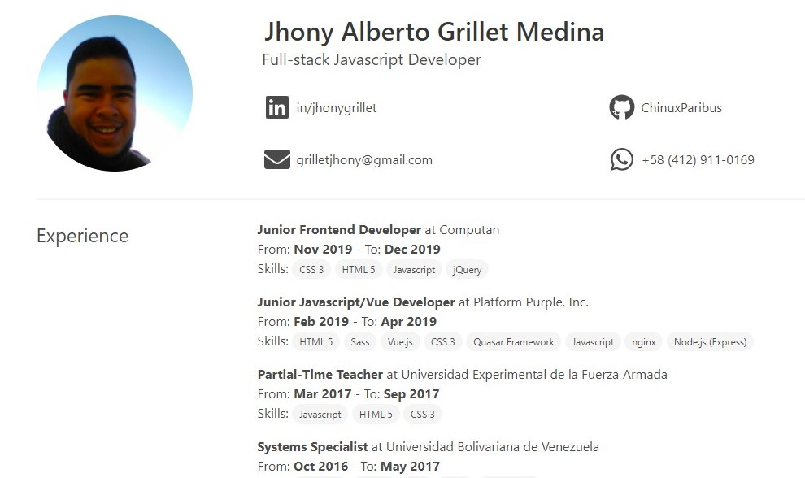

# Ejercicio Práctica "Crea tu Curriculum"

El objetivo del presente ejercicio es poner en práctica todo lo aprendido hasta la fecha. Recuerde poner en práctica todo lo aprendido y consultar sus dudas con el mentor.

Puede usar la imagen debajo como ejemplo/guía para el diseño (no tiene que ser idéntico, un poco de creatividad vale en este ejercicio, ¡vamos! :wink: )



## Instrucciones

1. Haga un fork del presente repositorio en su cuenta de Github

2. Abra el repositorio en Gitpod.

3. Recuerde cambiar el `origin` por el del repositorio en su cuenta:

```bash
git remote set-url https://github.com/<su-usuario-de-github>/4ga-practica-cv
```

4. ¡Éxitos!